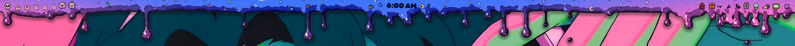
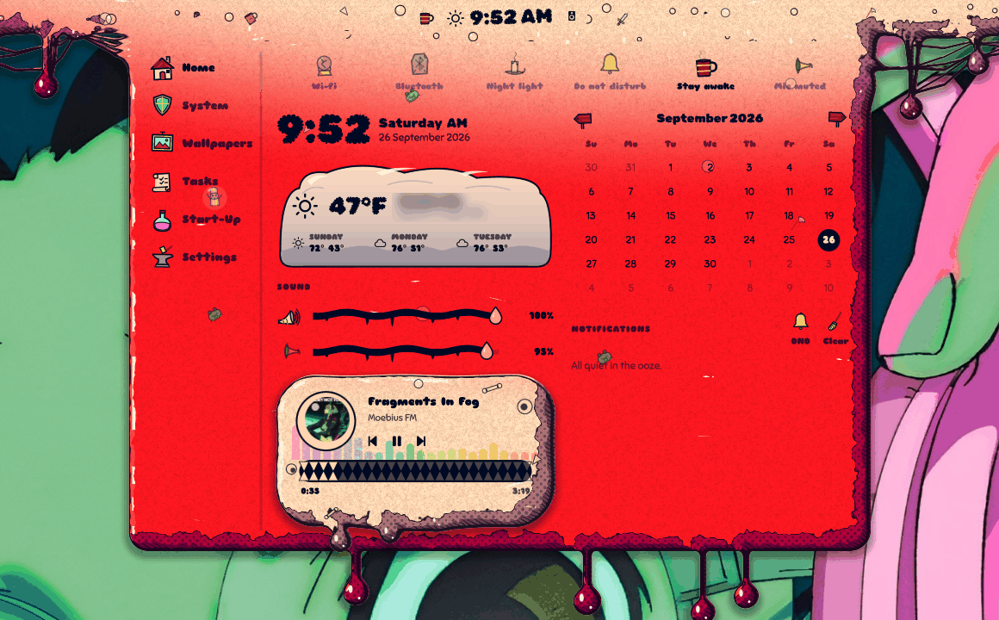
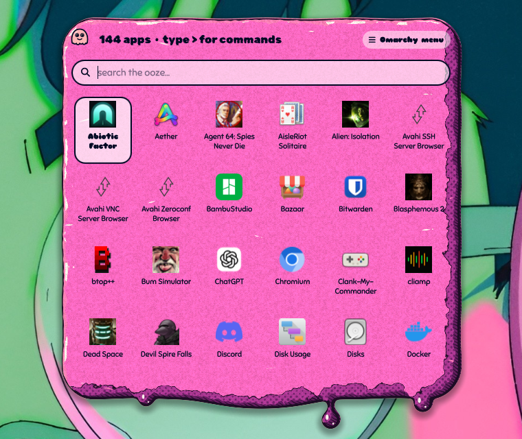
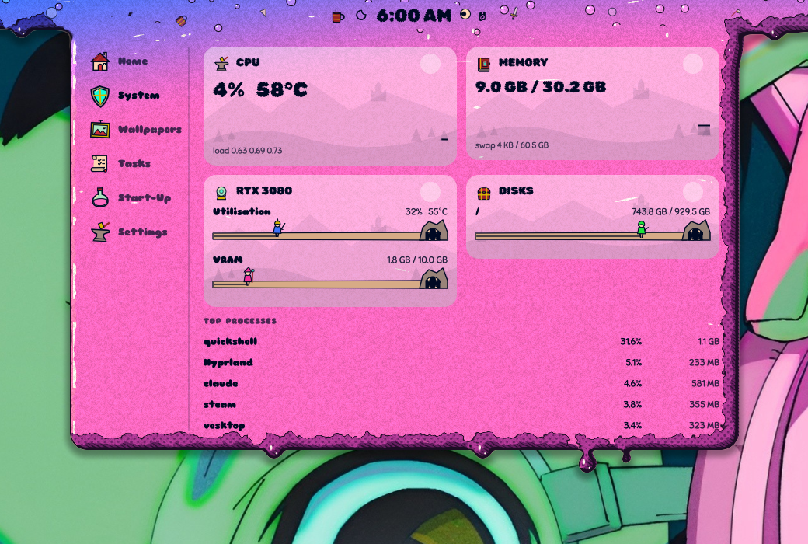
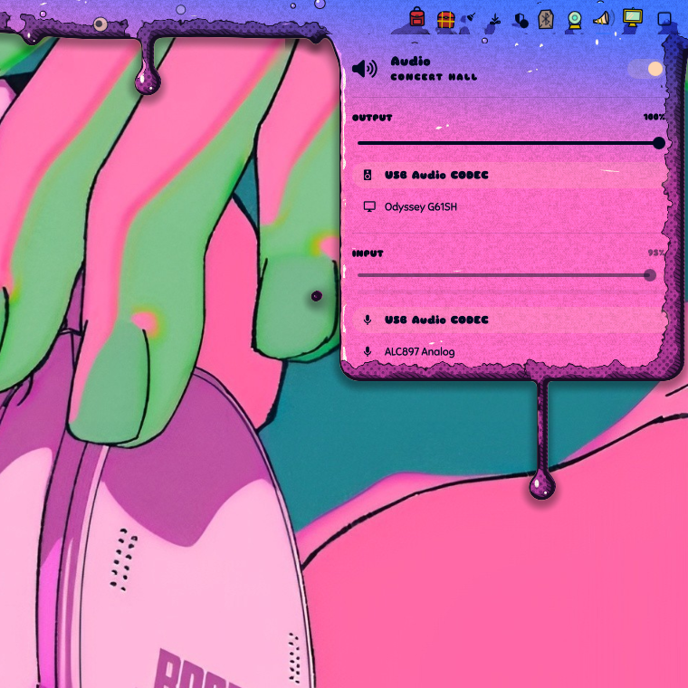
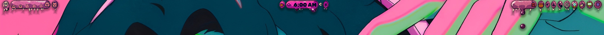
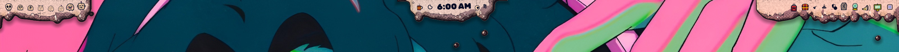
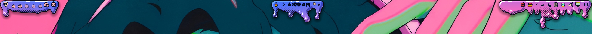

# Slime Shell

A slime-skinned bar suite for [Omarchy](https://omarchy.org): a shader-drawn
bar of dripping ooze (or sinew, or bone), widgets that float in it, panels
that drip out of it, and a command centre, app launcher and notifications to
match. Everything takes its colours from your Omarchy theme.



| | |
|---|---|
|  |  |
|  |  |

Mix a **material** (slime, sinew, bone, plain) with a **shape** (classic,
pills, islands, notch) and a **shading** style (soft, anime, manga, print):





## What's in it

- **The bar** (`slime.bar`) — Omarchy's bar engine (layout, drag-to-reorder,
  popouts, IPC) with the slime skin painted behind it. Works on any screen
  edge; widgets bob in the goo; drips, floating bits and the occasional
  easter egg.
- **Command centre** — Home (quick toggles, clock, weather, sound, media
  monster, calendar, notifications), System, Wallpapers, Tasks, Start-Up and
  Settings tabs.
- **Widgets** — launcher, workspaces, agents, media (a lich casting a
  visualizer), clock & weather, indicators, tray, treasure chest (widget
  picker), bluetooth, network, audio, display, power, keyboard layout,
  system update, spacers. See **[docs/widgets.md](docs/widgets.md)** for what
  every click does.
- **Launcher** — fuzzy search over apps, every Omarchy menu command (`>` for
  commands only) and your files (`/` for files only); drips from the bar when
  clicked, floats centred when summoned by keybind.
- **Notifications** — toasts drip out of the bar (top bar).
- **Tasks** — checkboxes from your notes (Envy, `~/Notes`, or any folder):
  [docs/tasks.md](docs/tasks.md).

## Install

Needs an up-to-date Omarchy (the Quickshell-based shell) plus `git`, `jq` and
`python3`. Optional: `cava` for the visualizers, `qt6-shadertools` if you edit
the shader.

```sh
git clone https://github.com/DasPoxy/slime-shell.git ~/Work/slime-shell
~/Work/slime-shell/bin/slime-shell use
```

`use` links the plugins into `~/.config/omarchy/plugins/`, backs up your
current bar layout, switches the bar to Slime, swaps in Slime's notification
server and restarts the shell. To go back:

```sh
~/Work/slime-shell/bin/slime-shell restore     # your previous bar, exactly
~/Work/slime-shell/bin/slime-shell status
```

The plugins are symlinks into the clone, so editing the repo changes the live
bar (restart with `omarchy restart shell` to be sure).

## Keybinds

Nothing is bound for you. Suggested lines for `~/.config/hypr/bindings.lua`
(unbind anything already on those keys first with `hl.unbind("...")`):

```lua
o.bind("SUPER + SHIFT + C", "Slime command centre", "omarchy-shell slime-shell toggleTab home")
o.bind("SUPER + R",         "Slime launcher",       "omarchy-shell slime-launcher apps")
o.bind("SUPER + ALT + S",   "Slime settings",       "omarchy-shell slime-shell toggleTab settings")
o.bind("SUPER + ALT + M",   "Slime system monitor", "omarchy-shell slime-shell toggleTab system")
```

Other IPC for binds or scripts:

```sh
omarchy-shell slime-shell toggle | open | close | tab <name> | toggleTab <name>
omarchy-shell slime-shell material slime|sinew|bone|plain
omarchy-shell slime-shell shape classic|pills|islands|notch
omarchy-shell slime-shell shading 0|1|2|3        # soft, anime, manga, print
omarchy-shell slime-shell drip drip|honey|rain|tar|frozen|stringy|lava
omarchy-shell slime-shell layer above|behind     # draw over or behind windows
omarchy-shell slime-shell toggleLayer           # flip between the two
omarchy-shell slime-shell color <theme role>     # accent, green, cyan, …
omarchy-shell slime-shell fps <n>                # 0 pauses the animation
omarchy-shell slime-launcher apps | icons
omarchy-shell slime-media toggle | next | previous
omarchy-shell slime-plugins toggle
omarchy-shell slime-workspaces menu
omarchy-shell slime-clock settings
```

## Settings

Command centre → **Settings** (sections fold open and closed):

- **Slime** — colour, gradient partner, material, bar position, bar shape,
  draw above/behind windows, bar debris, shading
- **Font & clock** — system font or a slime set (blobby, drippy, bubble),
  date/time order
- **Motion** — frame rate, drip style, drip amount
- **Updates** — check GitHub, update & restart
- **Widgets** — opens each widget's own settings

Skin settings are saved in `~/.config/omarchy/slime-shell/skin.json`;
per-widget settings in the widget's entry in `~/.config/omarchy/shell.json`.

## Updating

Settings → Updates → *Check for updates*, then *Update & restart* (it only
fast-forwards, and stays off if you have local changes). Or by hand:

```sh
git -C ~/Work/slime-shell pull && omarchy restart shell
```

## Layout of the repo

| Path | What |
|---|---|
| `plugins/slime.bar/` | the bar; `shaders/slime.frag` (skin), `commandcenter/`, `ui/` (shared panels, monsters, gear, debris), `fonts/` |
| `plugins/slime.*` | widgets, mostly cloned from Omarchy's and restyled |
| `plugins/slime.notifications/` | notification service |
| `layouts/default.json` | the bar layout `slime-shell use` installs |
| `bin/slime-shell` | install / use / restore |
| `bin/clone-omarchy-plugin` | clone another Omarchy plugin as `slime.<name>` |
| `docs/` | widget reference, tasks guide, pictures |
| `spike/` | the original standalone prototype |

After editing the shader, recompile it:

```sh
/usr/lib/qt6/bin/qsb --qt6 -o plugins/slime.bar/shaders/slime.frag.qsb plugins/slime.bar/shaders/slime.frag
```

## Credits

Built on Omarchy's shell plugins (MIT). Fonts: Chewy (Apache-2.0), Rubik Wet
Paint, Rubik Bubbles and Sniglet (SIL OFL) — licences in
`plugins/slime.bar/fonts/`.
