# Slime Shell

A slime-skinned bar suite for [Omarchy](https://omarchy.org): a shader-drawn
bar of dripping ooze (or sinew, or bone), widgets that float in it, panels
that drip out of it, and a command centre, app launcher and notifications to
match. Everything takes its colours from your Omarchy theme, and it runs on
any screen edge and any screen size.


| | |
|---|---|
|  |  |
|  |  |

## Looks

Mix a **material** (slime, sinew, bone, plain) with a **shape** (classic,
pills, islands, notch) and a **shading** style (soft, anime, manga, print):


### Drips

Pick how the ooze moves (**Settings → Motion → Drip style**, or
`omarchy-shell slime-shell drip <style>`):

| Style | |
|---|---|
| **drip** — the default | 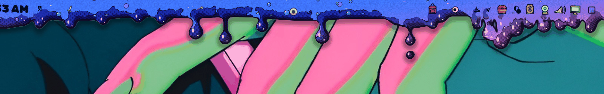 |
| **honey** — slow and thick | 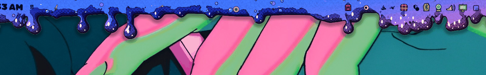 |
| **rain** — fast, thin and many | 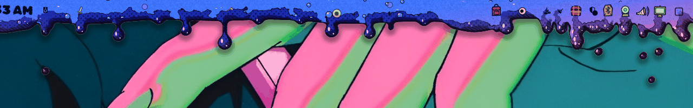 |
| **tar** — crawling, fat and few | 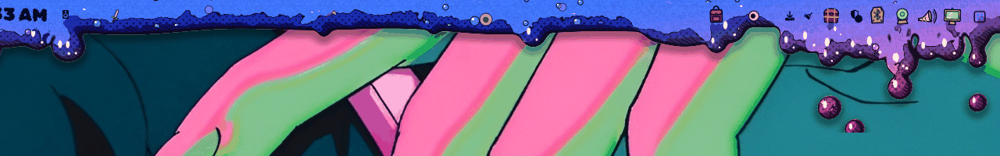 |
| **frozen** — hang still | 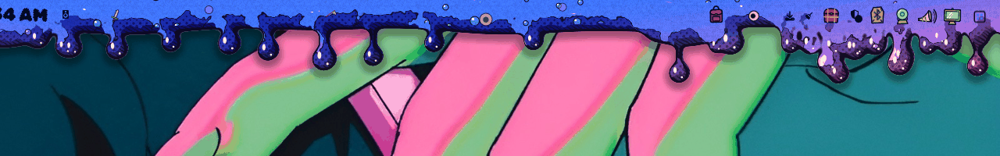 |
| **stringy** — hang by strands that thin as the glob pulls away, snap, and let it scatter; neighbouring drips (and widget drips) are webbed together in lattices | 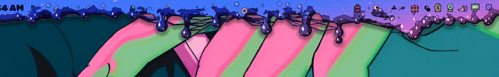 |
| **lava lamp** — globs of every shape bud off, pinch apart and sink | 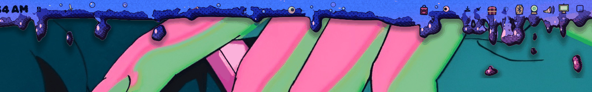 |

…and how much of it there is (**Drip amount**):

| Amount | |
|---|---|
| **dry** | 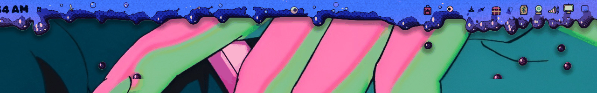 |
| **ooze** | 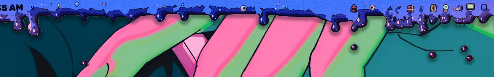 |
| **gush** | 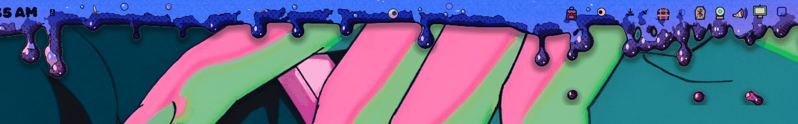 |
| **torrent** — longer and more of them | 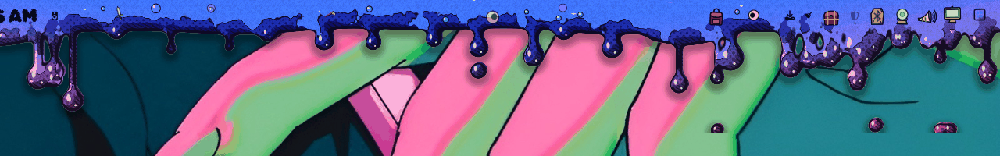 |
| **variable** — each drip waxes and wanes | 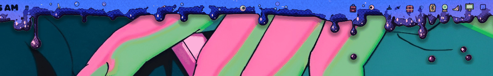 |

### Fonts

The system font, or a display face for clocks, temperatures and headings
(small text stays in the rounded, readable Sniglet):

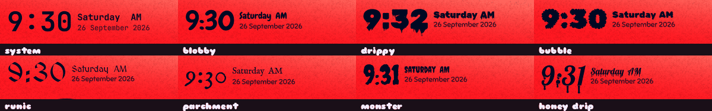

*Honey drip* is Lobster with drips grown onto every letter by
`tools/make-drip-font.py`.

### Slime icons

The slimes on the workspaces, the agents robot and the launcher can be pale
**paper** (they pop off the ooze), the theme's **colours** (each workspace a
different hue), or shaded with the **bar gradient** (Settings → Slime, or the
workspaces' right-click menu):

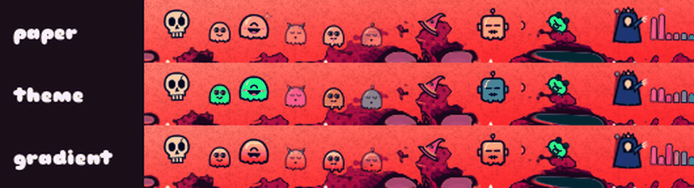

### Debris and easter eggs

With **bar debris** on, eyeballs, bones, teeth, bubbles, frogs, hats, swords
and tankards drift through the bar and behind the command centre, the
launcher and every widget panel (matched to the material: teeth and eyes in
sinew, bones and skulls in bone). Now and then a little adventurer — a gnome,
goblin, skeleton, knight, wizard or priest — gets stuck in a fat drip and
falls off with it, or turns up trapped in a panel's ooze.

## What's in it

- **The bar** (`slime.bar`) — Omarchy's bar engine (layout, drag-to-reorder,
  popouts, IPC) with the slime skin painted behind it. Top, bottom, left or
  right; widgets bob in the goo.
- **Command centre** — Home (quick toggles, clock, cloud-shaped weather,
  sound, the media monster, calendar, notifications), System (adventurers
  marching on a dungeon), Wallpapers, Tasks, Start-Up (apps to launch at
  login, and on which workspace) and Settings tabs. It fits any screen:
  capped to the space there is (tall tabs scroll) and scaled down on narrow
  or portrait screens.
- **Widgets** — launcher, workspaces, agents (its robot gets worried as your
  session usage climbs), media, clock & weather, indicators, tray, treasure
  chest (widget picker), bluetooth, network, audio, display, power, keyboard
  layout, system update, spacers. See **[docs/widgets.md](docs/widgets.md)**
  for what every click does.
- **Media** — a lich, wizard or priest (right-click to choose) casting the
  visualizer. Hover for a drip card with the album art, track, progress and
  which player to follow (whatever's playing, or stick to one). While
  hovering it — or the media slime in the command centre — **Space**
  plays/pauses and **M** mutes; a middle click plays/pauses too:

  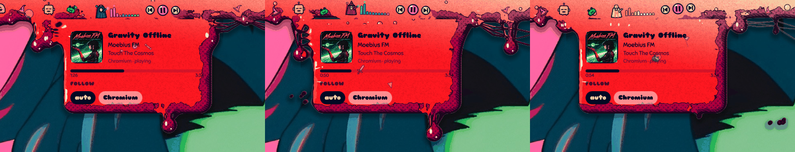
- **Spacers** — as many as you like, each holding plain ooze, a sagging lump
  or any floating bit; scroll to resize, right-click for options.
- **Launcher** — fuzzy search over apps, every Omarchy menu command (`>` for
  commands only) and your files (`/` for files only); drips from the bar when
  clicked, floats centred when summoned by keybind.
- **Notifications** — toasts drip out of the bar (top bar).
- **Tasks** — checkboxes from your notes (Envy, `~/Notes`, or any folder):
  [docs/tasks.md](docs/tasks.md).

## The bar

- **Drag widgets** to reorder them. In the *pills* shape, drop one onto the
  middle of another to join their pills. Inside a joined pill, drag a widget
  between its pill-mates to shuffle it, or onto one to swap them. Drag it to
  either end of the pill and two markers appear: the one just inside swaps it
  with the end widget, the one just past the end splits it into its own pill.
  A spacer on its own gets a pill of its own.
- **Above or behind windows** — draw the drips over your windows or tucked
  behind them (`toggleLayer`, or Settings → Slime).
- **Any plugin** — third-party Omarchy bar widgets work as normal and float
  in the goo; their panels open from the bar, or from Settings → Widgets.

## Install

Needs an up-to-date Omarchy (the Quickshell-based shell) plus `git`, `jq` and
`python3`. Optional: `cava` for the visualizers, `qt6-shadertools` if you edit
the shader.

```sh
git clone https://github.com/DasPoxy/slime-shell.git ~/Work/slime-shell
~/Work/slime-shell/bin/slime-shell use
```

`use` links the plugins into `~/.config/omarchy/plugins/`, backs up your
current bar layout, switches the bar to Slime, swaps in Slime's notification
server and restarts the shell. To go back:

```sh
~/Work/slime-shell/bin/slime-shell restore     # your previous bar, exactly
~/Work/slime-shell/bin/slime-shell status
~/Work/slime-shell/bin/slime-shell install     # just (re)link the plugins
```

The plugins are symlinks into the clone, so editing the repo changes the live
bar (restart with `omarchy restart shell` to be sure).

## Keybinds

Nothing is bound for you. Suggested lines for `~/.config/hypr/bindings.lua`
(unbind anything already on those keys first with `hl.unbind("...")`):

```lua
o.bind("SUPER + ALT + C",          "Slime command centre",       "omarchy-shell slime-shell toggleTab home")
o.bind("SUPER + R",                "Slime launcher",             "omarchy-shell slime-launcher apps")
o.bind("SUPER + ALT + S",          "Slime settings",             "omarchy-shell slime-shell toggleTab settings")
o.bind("SUPER + ALT + M",          "Slime system monitor",       "omarchy-shell slime-shell toggleTab system")
o.bind("SUPER + ALT + X",          "Slime tasks",                "omarchy-shell slime-shell toggleTab tasks")
o.bind("SUPER + CTRL + SHIFT + Z", "Slime above/behind windows", "omarchy-shell slime-shell toggleLayer")
```

Other IPC for binds or scripts:

```sh
omarchy-shell slime-shell toggle | open | close | tab <name> | toggleTab <name>
omarchy-shell slime-shell material slime|sinew|bone|plain
omarchy-shell slime-shell shape classic|pills|islands|notch
omarchy-shell slime-shell shading 0|1|2|3        # soft, anime, manga, print
omarchy-shell slime-shell drip drip|honey|rain|tar|frozen|stringy|lava
omarchy-shell slime-shell layer above|behind     # draw over or behind windows
omarchy-shell slime-shell toggleLayer            # flip between the two
omarchy-shell slime-shell color <theme role>     # accent, green, cyan, …
omarchy-shell slime-shell gradient <theme role>  # the gradient partner, auto or none
omarchy-shell slime-shell fps <n>                # 0 pauses the animation
omarchy-shell slime-shell egg                    # (shh) summon a trapped adventurer
omarchy-shell slime-launcher apps | icons
omarchy-shell slime-media toggle | next | previous
omarchy-shell slime-plugins toggle
omarchy-shell slime-workspaces menu
omarchy-shell slime-clock settings
omarchy-shell shell toggle <widget id>           # any bar widget's panel, e.g. slime.audio
```

## Settings

Command centre → **Settings** (sections fold open and closed):

- **Slime** — colour, gradient partner, material, bar position, bar shape,
  draw above/behind windows, bar debris, slime icon colours, shading
- **Font & clock** — system font or a display face (blobby, drippy, bubble,
  runic, parchment, monster, honey drip), date/time order
- **Motion** — frame rate, drip style, drip amount
- **Updates** — check GitHub, update & restart
- **Widgets** — each Slime widget's settings, and a button for every bar
  widget (yours and third-party) that drips its panel open

Skin settings are saved in `~/.config/omarchy/slime-shell/skin.json`;
per-widget settings in the widget's entry in `~/.config/omarchy/shell.json`.

## Updating

Settings → Updates → *Check for updates*, then *Update & restart* (it only
fast-forwards, and stays off if you have local changes). Or by hand:

```sh
git -C ~/Work/slime-shell pull && omarchy restart shell
```

## Layout of the repo

| Path | What |
|---|---|
| `plugins/slime.bar/` | the bar; `shaders/slime.frag` (the skin), `commandcenter/`, `ui/` (shared panels, monsters, gear, debris), `fonts/` |
| `plugins/slime.*` | widgets, mostly cloned from Omarchy's and restyled |
| `plugins/slime.notifications/` | notification service |
| `layouts/default.json` | the bar layout `slime-shell use` installs |
| `bin/slime-shell` | install / use / restore / status |
| `bin/clone-omarchy-plugin` | clone another Omarchy plugin as `slime.<name>` |
| `tools/make-drip-font.py` | builds the honey-drip font from Lobster |
| `docs/` | widget reference, tasks guide, pictures |
| `spike/` | the original standalone prototype |

How it's drawn: one signed-distance-field shader draws the whole scene (bar,
drips, bulbs under widgets, panels, the command centre). The bar window is
exactly the bar — so widget panels, including third-party ones, size and
place themselves as they would on Omarchy's own bar — and a second,
fixed-size, click-through window just past it carries the drips and the
command centre. Both run the same shader with the same inputs, so the goo is
seamless across them.

After editing the shader, recompile it:

```sh
/usr/lib/qt6/bin/qsb --qt6 -o plugins/slime.bar/shaders/slime.frag.qsb plugins/slime.bar/shaders/slime.frag
```

## Credits

Built on Omarchy's shell plugins (MIT). Fonts: Chewy (Apache-2.0); Rubik Wet
Paint, Rubik Bubbles, Sniglet, MedievalSharp, IM Fell English, Creepster, and
Slime Honey Drip — Lobster with drips added by `tools/make-drip-font.py`
(SIL OFL). Licences in `plugins/slime.bar/fonts/`.

## Licence

MIT — see [LICENSE](LICENSE), which also carries Omarchy's MIT notice for the
parts derived from its plugins. Fonts keep their own licences.
