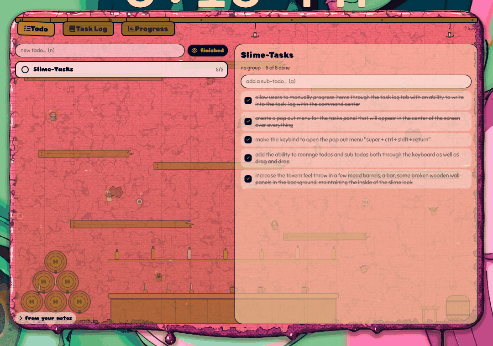
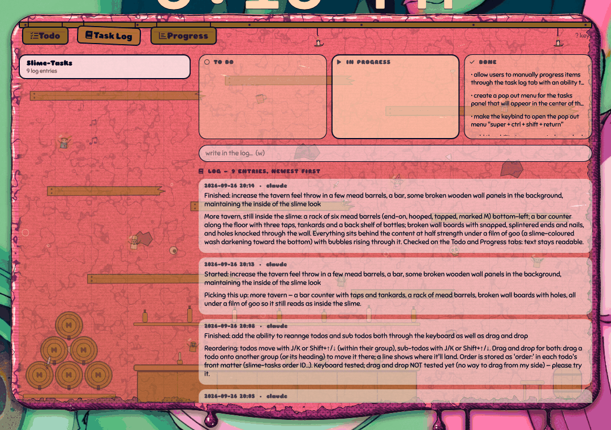

# Slime-Tasks — the command centre's Tasks tab

A todo, task-log and progress suite built into the command centre, in a
tavern the slime has swallowed whole — signs on a beam, lanterns, a rack of
mead barrels, a bar with its taps and bottles, broken wall boards, and the
regulars (bards, knights, rogues, orcs, goblins…) adrift in the goo.

| | |
|---|---|
|  |  |

Three signs hang from the beam:

| Tab | What it's for |
|---|---|
| **Todo** | Top-level todos, grouped and colour-coded. Each opens into its own list of sub-todos, which move *to do → in progress → done*. |
| **Task Log** | What's being worked on: each todo's sub-todos in *to do / in progress / done* lanes, and its log of progress notes and output (newest first). Agents fill this in as they work, and so can you: click a sub-todo to move it a lane on (right-click: back), and write your own log entries. |
| **Progress** | How far along every group and todo is, in collapsible sections. Archive finished lists; search the archive and restore them. |

**Pop-out:** `omarchy-shell slime-shell tasks` (suggested key: **Super+Ctrl+Shift+Return**)
opens the whole suite in a floating panel in the middle of the screen, over
everything. **Esc** closes it.

Everything is keyboard driven — press **?** in the tab for the full list:

- **Tab / 1 2 3** switch tabs · **Esc** backs out (or closes the command centre)
- Todo: **↑↓** pick · **→/Enter** open sub-todos · **n** new · **a** add sub-todo ·
  **Space** finish / cycle a sub-todo · **e** rename/edit · **g** group menu ·
  **A** archive · **d d** delete · **f** show/hide finished ·
  **J/K** or **Shift+↑↓** move the todo / sub-todo

**Shift+↑↓ moves whatever is highlighted**, on every tab: a todo (within its
group), a sub-todo (in the Todo tab's list, or past its neighbour in a Task
Log lane), a group heading (group order is shared by all three tabs), or —
with the log by sub-todo — a whole log section (which moves that sub-todo).

Groups fold the same way on all three tabs: click a heading, or press
**←** / **z** on a todo to fold its group (the highlight moves to the
heading), and **Enter / Space / →** on a heading to unfold it. On the
Progress tab **→ / ←** first open and close a todo's sub-todos. Each tab
remembers its own folds across restarts.
- Task Log: todos are grouped and ordered like on the Todo tab · **L** (here
  or on the Todo tab) jumps straight to the selected todo's log · **↑↓** pick ·
  **→/Enter** into the lanes, then **→/Space** move a sub-todo on and **←**
  back · **↓** past the last lane item goes on into the log, where **↑↓** pick
  an entry · **s** shows the log newest first or in sections by sub-todo
  (sections fold like groups: **←**/**z** on an entry folds its section,
  **Enter/Space/→** on a heading unfolds it; remembered per todo) ·
  **Enter** on an entry opens it over the whole panel, on a sheet of worn
  parchment, for reading, where
  **c** copies it, **e** edits its text (**Ctrl+S** saves, **Esc** cancels)
  and **Esc** closes; **c** / **e** work on the highlighted entry too ·
  **w** write in the log (about the sub-todo picked in the lanes) ·
  **PgUp/PgDn** scroll
- Progress: **↑↓** pick · **Enter/Space** expand · **A** archive · **↓** past
  the end drops into the archive — sorted by group, whose headings fold like
  everywhere else — where **Enter/r**
  restores (you stay in the archive, to restore several), **g** or a
  right-click gives a menu to set its group, restore or delete it, and
  **↑**/**Esc** climb back · **/** search the archive (Enter drops into the results)

On a group heading, **A** archives the whole group, and **g** (or a
right-click) opens a group menu to archive or delete it. In any group menu,
**d d** on a group deletes that group — its todos just become ungrouped. On
any group heading, on every tab, **e** renames the group and **d d** deletes it.

**Super groups** hold other groups. From a group's menu (**g** or right-click)
pick *into super group …*, *out of super group …*, or type a name in *new
super group…* (**n**). A super group's heading sits above its groups on all
three tabs (Progress shows their combined %), and works just like a group
heading: click / **Enter** / **z** / **←** **→** folds it, **e** renames it,
**d d** deletes it (its groups are kept), **Shift+↑↓** moves it, and **g** or a
right-click opens its menu.

Right-click a todo for the same group menu (existing groups, a new one, no
group, rename, archive, delete). Each group gets its own colour. Drag todos
and sub-todos to reorder them; drop a todo in another group (or on its
heading) to move it there.

## Where it's stored

Plain markdown in **`~/Documents/Slime-Notes`**, so Envy, Obsidian or any text
editor can read and edit it too:

```
Slime-Notes/
  Todos/<id>.md        one per todo
  Logs/<id>.md         its task log
  Archive/             archived todos (Archive/Logs/ their logs)
  .slime/groups.json   group colours, order and super groups
  .slime/trash/        deleted todos, just in case
```

A todo file:

```markdown
---
group: Slime Shell
done: false
created: 2026-09-26 13:40
---
# Overhaul the tasks tab

- [ ] a sub-todo
- [/] one being worked on
- [x] one that's finished
```

A log file is a list of `## <date time> · <who> · <sub-todo>` entries (the
sub-todo part only when an entry is about one) with markdown under each, code
blocks included. The Task Log tab labels every entry with its todo and
sub-todo.

**With Envy (or another notes app):** point it at the folder, or move the
folder inside your vault and tell Slime-Tasks where it went:

```sh
slime-tasks folder ~/Documents/Envy/Slime-Notes
```

The **From your notes** section at the bottom of the Todo tab still lists
every `- [ ]` checkbox in your notes vault (Envy's, `~/Notes`, or a folder you
choose) and ticks them in place, as the old Tasks tab did.

## For agents and scripts

`slime-tasks` (installed to `~/.local/bin` by `slime-shell install`) is the
same backend the tab uses. Every command prints JSON; failures go to stderr
with a non-zero exit.

```sh
slime-tasks find "tasks tab"                    # -> the todo's id
slime-tasks list                                # every todo and sub-todo
slime-tasks add "Overhaul the tasks tab" --group "Slime Shell"
slime-tasks sub-add <id> "Backend CLI"
slime-tasks start <id> <n> "picking this up" --by claude     # -> in progress, logged
slime-tasks log <id> "progress, output, findings…" --by claude [--sub <n>]
slime-tasks log-edit <id> <n> "new text" [--expect "old text"]   # n: 0 = oldest
slime-tasks finish <id> <n> "done: 12 tests pass" --by claude  # -> done, logged
slime-tasks sub-set <id> <n> todo|doing|done [--expect TEXT]
slime-tasks order <id> <id> …                   # put todos in this order
slime-tasks group-order <group> <group> …       # put groups in this order
slime-tasks group-archive <group>               # archive every todo in a group
slime-tasks group-delete <group>                # remove a group (todos kept, ungrouped)
slime-tasks group-rename <old> <new>            # rename a group (keeps colour and order)
slime-tasks super-set <group> <super>           # put a group in a super group ("" takes it out)
slime-tasks super-rename <old> <new>            # rename a super group
slime-tasks super-delete <super>                # remove a super group (its groups are kept)
slime-tasks super-order <super> <super> …       # put super groups in this order
slime-tasks archive <id>   /   unarchive <id>
slime-tasks --help                              # everything else
```

`<n>` is a sub-todo's 0-based position. The tab re-reads the folder every two
seconds while it's open, so you can watch an agent shift sub-todos across the
lanes and write its log. Writes are locked and atomic, so the tab and an agent
never clobber each other; `--expect` makes a state change refuse if the
sub-todo's text changed meanwhile.
