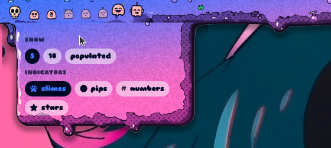
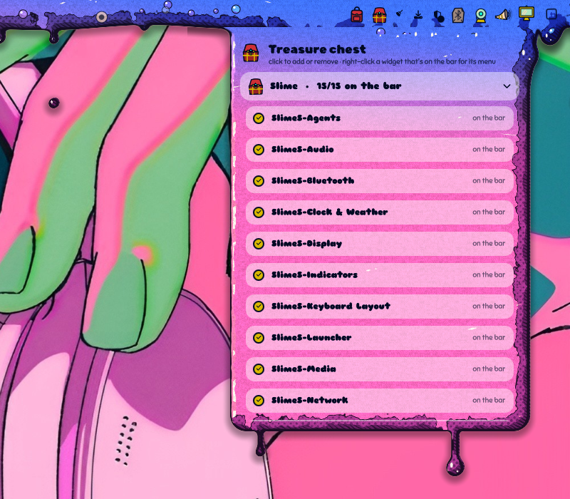

# Slime Shell widgets

Every Slime widget, what it looks like, and what each click does. Widgets
cloned from Omarchy keep Omarchy's panels and behaviour; the look is Slime's.
Add or remove widgets from the **treasure chest** on the bar, or drag them
around the bar to reorder (in *pills* shape, drop one onto the middle of
another to join their pills; drag it away to split them again. Inside a
joined pill, drag a widget between its pill-mates to shuffle it along, or
onto the middle of one to swap the two — the pill stays whole. Drag it to
either end of its pill and two markers appear: the one just inside the pill
swaps it with the end widget, the one just past the end splits it off into a
pill of its own).

## Left side

### Launcher — `slime.menu`
A slime monster (or other icon).

| | |
|---|---|
| Left click | app launcher, dripping from the bar |
| Middle click | terminal |
| Right click | icon picker (6 monsters, potion, skull, chest, orb, pack, candle, Omarchy logo) |
| Keybind | `omarchy-shell slime-launcher apps` opens it centred on screen |

In the launcher: type to fuzzy-search apps, Omarchy commands and files (top 5
files once you've typed 3 letters). Start with `>` for commands only or `/`
for files only. Arrows/Tab to move, Enter to run or open, Esc to close. Each
file has a folder button to open where it lives. The *Omarchy menu* button
opens Omarchy's own menu.

The file index covers `~` and mounted drives (`/mnt`, `/run/media`), skips
backups (Timeshift), Steam/game libraries, Wine prefixes, mod folders and
caches, and is cached in `~/.cache/slime-shell/files.txt`, refreshed in the
background when older than 10 minutes. Add your own skips (fd exclude globs,
one per line) to `~/.config/omarchy/slime-shell/file-search-ignore`.

### Workspaces — `slime.workspaces`

| | |
|---|---|
| Left click | go to that workspace |
| Right click | menu: show **5**, **10** or **populated**; indicators **slimes**, **pips**, **numbers** or **stars**; slime colours **paper**, **theme colours** or **bar gradient** (shared with every slime icon) |

Slime monsters sleep on empty workspaces, blink on busy ones and cheer on the
focused one. They follow the bar's material.

### Agents — `slime.agents`
A slime robot. Omarchy's agents panel (usage limits, tokens by day/model).
Its face follows your tightest usage window: happy, then flat-faced and
yellowish past 50%, worried and sweating (orange) past 75%, red and panicking
past 90%. Preview a level with `omarchy-shell omarchy.agents previewUsage 0.8`
(`-1` goes back to the real value).

| | |
|---|---|
| Left click | usage panel |
| Right click | launch the agent |
| Middle click | next subscription |

### Karaoke (media) — `slime.media`
SlimeS-Karaoke: a caster (lich, wizard, priest, dryad, witch, a slime full of
wands, or a wisp) casting the music visualizer, then previous / play / next
bubbles. That's its idle form; left-click it and it sings: each line of the
song's lyrics drips out of the bar under the widget as a round bead of goo on
a neck, sinking lower as the line is sung — the word being sung sits in a
glossy bubble, the words still to come fainter (timed per word when the
lyrics carry word times, otherwise spread through the line); when the line ends the neck snaps
and the bead drops and bursts into droplets, words and any debris in it
scattering, as the next line drips down (a ♪ bubble on the caster shows
karaoke is on). The beads wear the bar's material, colours, shading and
debris, and clicks go straight through them. Hidden when nothing is playing.

Lyrics come from [LRCLIB](https://lrclib.net) (free, no account): only the
artist, title, album and length are sent, and each song's answer is cached in
`~/.cache/slime-shell/lyrics/`.

| | |
|---|---|
| Hover the caster | a drip card: album art, title, artist, album, progress, and which player to follow (auto, or stick to one) |
| Left click the caster or visualizer | karaoke on / off |
| Right click the caster | settings: who casts the spell, visualizer on/off, karaoke on/off, *the whole song* (every line, the current one lit — click a line to jump there), refresh lyrics, which player to follow |
| Scroll over the caster | previous / next track |
| Middle click | play / pause |
| Hover, then **Space** / **M** | play / pause, mute / unmute the output |

The media slime in the command centre takes the same middle click and
hover keys.

### Spacer — `slime.spacer`
A gap in the bar holding plain ooze, a sagging lump, or any floating bit
(eyeball, sword, axe, wizard hat, frog, tankard, potion, skull…).

| | |
|---|---|
| Hover | dashed outline and width |
| Scroll | resize |
| Right click | size, contents, *add another spacer*, *remove* |

Each spacer keeps its own settings.

## Centre

### Clock & weather — `slime.clock-weather`

| | |
|---|---|
| Left click | command centre |
| Right click | full weather panel |
| Middle click | date & time settings: 12/24h, date pattern, weather as icon / temperature / both, order, weight, size |

On side bars it stacks: weather, hours, minutes, date.

### Indicators — `slime.indicators`
Candle (night light), strapped bell (do not disturb), tankard (stay awake),
hourglass (reminders), eyeball (screen recording), ear trumpet (dictation).
Click one to toggle it. Inactive ones show on hover.

### System update — `slime.system-update`
A little character in the bar (a town crier by default, trapped in a bubble
of goo) who stays quiet while Omarchy is up to date and acts up when there
are updates: the crier rings his bell and yells, the bard strums, the knight
kneels, the jester juggles, the candle lights, the slime emotes. Checks every
six hours.

| | |
|---|---|
| Left click | a drip panel: up to date or what's pending, *Update now*, *Check again* |
| Right click | a drip menu: the character, and the bubble on / off |

IPC: `omarchy-shell omarchy.system-update toggle | menu | refresh`.

### Keyboard layout
Omarchy's widget with Omarchy's own click behaviour, restyled for the bar.

## Right side

### Tray — `slime.tray`
A backpack that opens as the tray expands (hover).

| | |
|---|---|
| Left click an item | activate |
| Right click an item | its menu |
| Right click the backpack | choose hidden items |

### Treasure chest — `slime.plugins`

Every installed bar widget, in foldable **Slime / Omarchy / Community**
sections.

| | |
|---|---|
| Click an entry | add it to the bar / remove it |
| Right click an entry | send that widget a right click (opens its menu) |

### Bluetooth — `slime.bluetooth` (runestone)
Left click: panel. Right click: bluetooth on/off.

### Network — `slime.network` (crystal orb)
Left click: panel. Wi-Fi arcs light up with signal; a glowing core on
ethernet; cracked when offline.

### Audio — `slime.audio` (war horn)
Left click: panel. Right click: mute everything. Scroll: volume.

### Display — `slime.monitor` (mirror)
Left click: panel. Scroll: brightness.

### Power — `slime.power`
Omarchy's battery / power profile panel (hidden without a battery).

## Not on the bar

- **Notifications** — `slime.notifications`, replaces Omarchy's server while
  Slime is active (`slime-shell use` / `restore` swap them).
- **Command centre** — part of `slime.bar`; see the README for its tabs.
